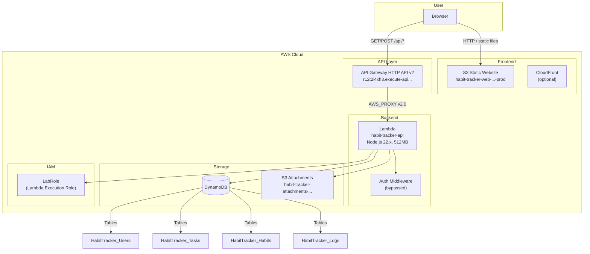

# Arsitektur AWS — Habit Tracker

## Mermaid Diagram



## Alur Request

```
Browser ──► S3 (static assets: HTML, JS, CSS)
   │
   └──► API Gateway ──► Lambda ──► Auth (bypass) ──► DynamoDB
                                                      │
                                                      └──► S3 (attachments)
```

## Komponen Utama

| Komponen | Fungsi |
|----------|--------|
| **S3 Web** | Hosting SPA (Vite build output), bucket policy public |
| **API Gateway HTTP API** | Entry point API, CORS enabled, forward ke Lambda |
| **Lambda** | Backend Express.js via serverless-http, IAM Role = LabRole |
| **DynamoDB** | 4 tabel NoSQL untuk Users, Tasks, Habits, Logs |
| **S3 Attachments** | Upload file user (gambar habit, dll) |

## Kelemahan / Next

- **Tidak ada CDN** — S3 langsung serving; bisa tambah CloudFront untuk caching + HTTPS custom domain.
- **Cold start Lambda** — request pertama lambat (Node.js + Express bundle).
- **Auth stubbed** — tidak ada JWT/register/login.
- **No CI/CD** — deploy manual via AWS CLI.
