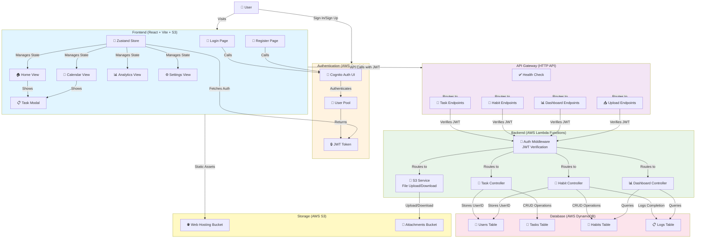
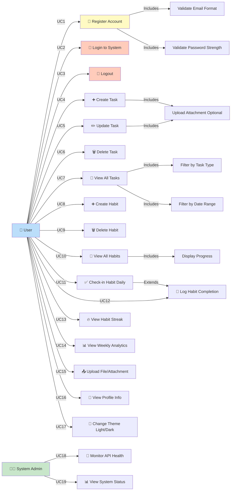
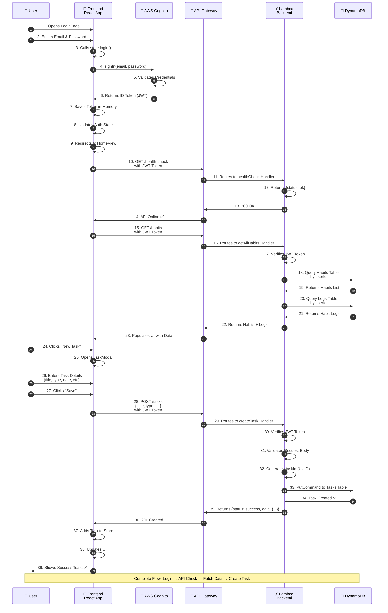
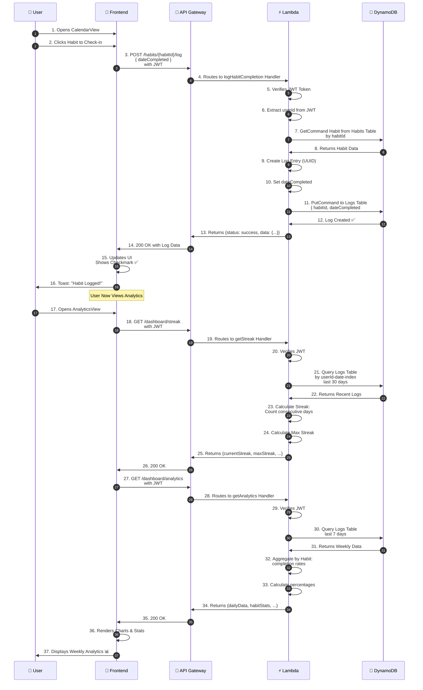
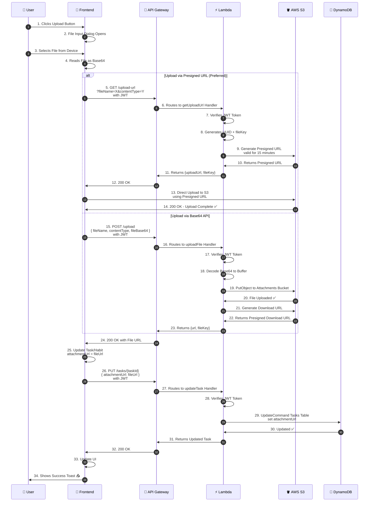
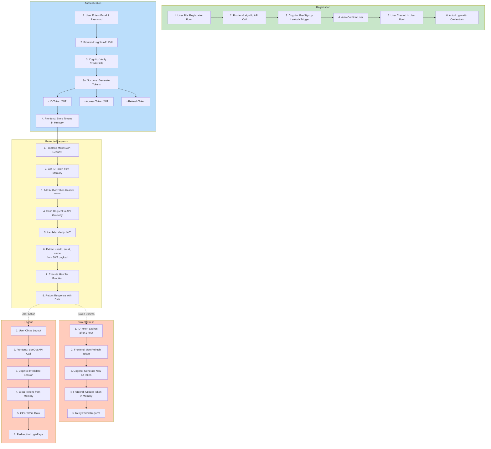

# Habit Tracker - Mermaid Diagrams

Dokumentasi visual untuk sistem Habit & Task Tracker dengan arsitektur AWS Serverless.

---

## 1. System Architecture Diagram (Alur Kerja Sistem)

Diagram ini menunjukkan alur kerja keseluruhan sistem dari frontend hingga backend dan database.



---

## 2. Use Case Diagram

Diagram ini menunjukkan berbagai use case (kasus penggunaan) yang dapat dilakukan oleh user dalam sistem.



---

## 3. User Authentication & Task Creation Sequence Diagram

Diagram ini menunjukkan sequence flow ketika user melakukan login, kemudian membuat task baru.



---

## 4. Habit Completion & Analytics Sequence Diagram

Diagram ini menunjukkan sequence flow ketika user check-in/log habit dan view analytics.



---

## 5. File Upload Sequence Diagram

Diagram ini menunjukkan sequence flow ketika user upload file/attachment.



---

## 6. Data Relationships Diagram

Diagram ini menunjukkan hubungan antara entities dalam DynamoDB.

```mermaid
erDiagram
    USERS ||--o{ TASKS : owns
    USERS ||--o{ HABITS : owns
    USERS ||--o{ LOGS : owns
    HABITS ||--o{ LOGS : tracked-by
    TASKS ||--o{ ATTACHMENTS : contains
    
    USERS {
        string userId PK
        string email
        string name
        string createdAt
        datetime lastLogin
    }
    
    TASKS {
        string userId PK
        string taskId SK
        string title
        string type
        date startDate
        date endDate
        string repeatableType
        string attachmentUrl
        datetime completedAt
        datetime createdAt
        datetime updatedAt
    }
    
    HABITS {
        string userId PK
        string habitId SK
        string title
        string type
        string repeatableType
        datetime createdAt
        datetime updatedAt
    }
    
    LOGS {
        string habitId PK
        string dateCompleted#logId SK
        date dateCompleted
        string logId
        datetime createdAt
    }
    
    ATTACHMENTS {
        string fileKey
        string fileName
        string s3Url
        datetime uploadedAt
    }
```

---

## 7. Authentication Flow Diagram

Diagram ini menunjukkan detail alur otentikasi menggunakan AWS Cognito dan JWT.



---

## Summary

Sistem Habit Tracker menggunakan arsitektur **True Serverless** dengan komponen:

| Komponen | Teknologi | Role |
|----------|-----------|------|
| **Frontend** | React 19 + Vite + Zustand | UI, State Management, Auth |
| **Authentication** | AWS Cognito + JWT | User Registration, Login, Token Management |
| **Backend** | Node.js Lambda Functions | Business Logic, Data Operations |
| **API** | API Gateway HTTP API | Request Routing, CORS |
| **Database** | DynamoDB | Data Storage (Pay-Per-Request) |
| **Storage** | AWS S3 | File Uploads, Static Website |

**Key Features:**
- ✅ True Serverless (Individual Lambda per Endpoint)
- ✅ JWT-based Authentication
- ✅ Real-time Task & Habit Tracking
- ✅ Analytics & Streak Calculation
- ✅ File Upload Support
- ✅ Dark/Light Theme Toggle
- ✅ Responsive UI Design
